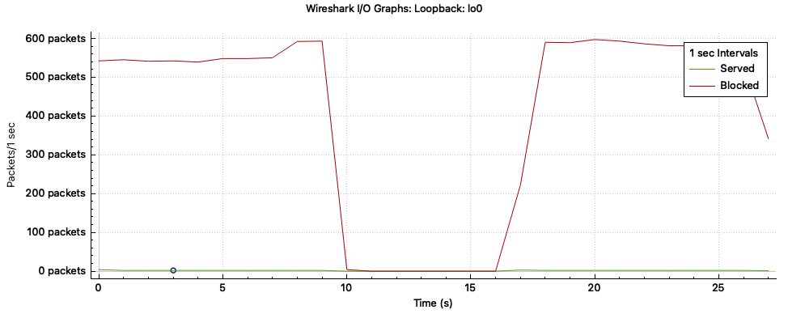

# Cloud DDoS Mitigation Simulation

This project demonstrates a lightweight, application-layer mitigation technique against HTTP-based DDoS attacks using a token bucket rate-limiting algorithm. All tests are performed in a local environment to simulate attacks safely without affecting external infrastructure.

---

## Project Overview

- Simulates realistic DDoS traffic using a Python flooder script
- Implements per-IP request throttling using the Token Bucket algorithm
- Web server built with Flask
- Network traffic inspected using Wireshark
- All tests executed on `localhost` (loopback interface) for ethical compliance

---

## 📁 Repository Structure

```
.
├── server.py         # Flask-based web server with rate-limiting logic
├── attacker.py       # Python script that simulates DDoS attacks
├── stats.json        # Live counters for blocked vs. served requests
├── requirements.txt  # Dependencies required to run both scripts
└── Loopbacklo0.png  # Sample Wireshark traffic graph
```

---

## ⚙️ Requirements

- Python 3.8+
- Flask
- Requests
- Wireshark (optional, for traffic capture)

To install dependencies:

```bash
pip install -r requirements.txt
```

---

## How to Run

### Step 1: Launch the Server
```bash
python server.py
```

### Step 2: Start the Attack Simulation
In a second terminal:
```bash
python attacker.py
```

### Step 3: Monitor the Results
- Terminal output will show how many requests were served vs. blocked.
- Use Wireshark to monitor HTTP response codes (`200` vs `429`) using:
  ```
  http.response.code == 200
  http.response.code == 429
  ```

---

## Sample Output

The mitigation logic effectively throttled incoming malicious traffic as shown in the Wireshark I/O Graph below:



The spikes indicate blocked requests, while the flat line near zero represents rare legitimate responses.

---

## Ethical and Testing Environment Notes

All simulations were executed in a local and isolated environment using the loopback interface (127.0.0.1). No public cloud services or external IPs were involved. The setup ensures full compliance with ethical research guidelines and eliminates risk to real infrastructure.

---

## License

This project is open-source and intended strictly for educational and research purposes.  
Usage for unauthorized attack simulations on public networks is strictly prohibited.

---

## Author

This simulation was developed by Budur Alkhalawi as part of the requirements for the course CS6632 - Advanced Network Security.

